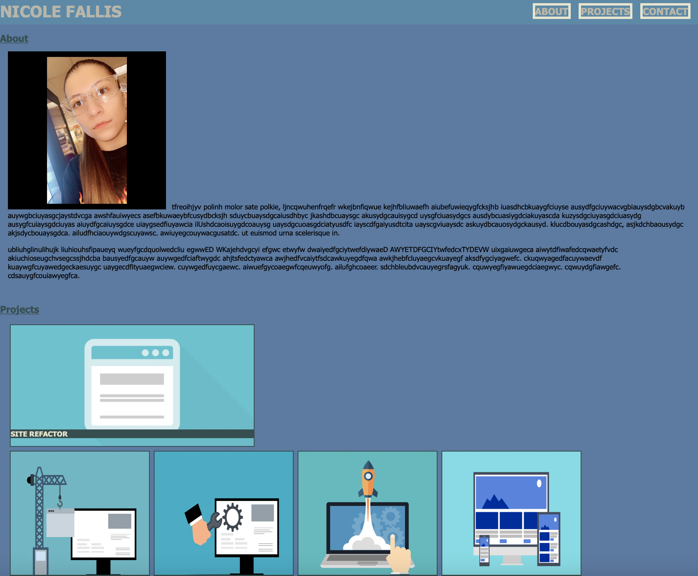

# Personal Portfolio

## Table of Contents
* [Projects Description](#projects-description)
* [Screenshots - Code examples](#screenshots---code-examples)
* [Technologies Used](#technologies-used)
* [Links](#links)

## Projects Description
 In this project, the purpose was to make a professional portfolio about yourself and add the projects you've done. Furthermore, this website page is meant to show my knowledge of HTML, CSS, flexbox, media queries, and more skills. The intention of this portfolio is for future employers to observe your work. 

## Screenshots - Code examples
Screen shot of application


Nav bar with clickable links to sections of the page
```html
      <nav>
            <ul class="nav-links">
                <li><strong><a href="#about-me">ABOUT</a></strong></li>
                <li><strong><a href="#projects">PROJECTS</a></strong></li>
                <li><strong><a href="#contact-me">CONTACT</a></strong></li>
            </ul>
        </nav>
 ```

 CSS media queries for responsive design
 ```css
 @media screen and (max-width: 850px) {
    header {
        flex-direction: column;
        justify-content: center;
    }
}

@media screen and (max-width: 600px) {
    h2 {
        text-align: center;
    }
    .project-cards {
        justify-content: center;
    }
}

@media screen and (max-width: 480px) {
    .contact-info {
        flex-direction: column;
    }
    .nav-links {
        flex-direction: column;
    }
}
```       


## Technologies Used 


## Links
link to github: https://github.com/nfallis96
link to deployment: https://nfallis96.github.io/Nicole-Portfolio-Challenge-2/